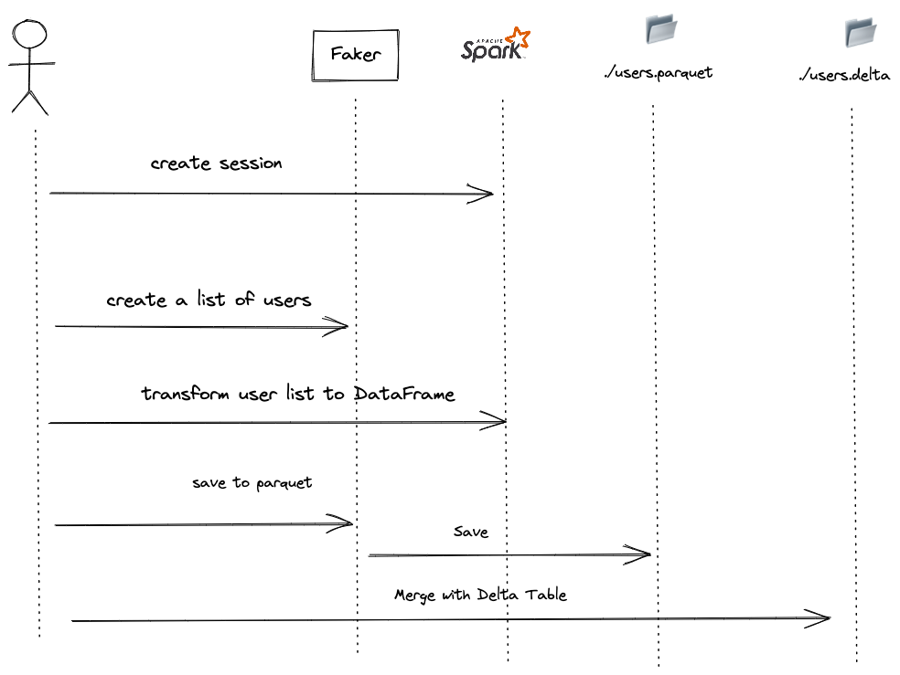

# A simple example to show how to use the library [delta.io](delta.io) with Spark 3.3.0

## This example shows how to use the library to read a delta table and write a delta table

Delta is a newer format, developed by Databricks, and is based on the Apache Parquet format. Delta provides many of the same benefits as Parquet, such as efficient storage and fast querying, but also adds additional features like transaction support and schema evolution. This makes Delta a good choice for real-time data pipelines, where data is constantly changing and being updated.

## How to run this example 🚀

```bash 
sbt run
```

## Structure of the project 📁

```bash
./src
└── main
    └── scala
        ├── Faker.scala
        └── SimpleSparkApp.scala
./build.sbt
```


## What this example is doing ?

👉 This program is written in the Scala programming language and it uses Apache Spark, a popular distributed computing framework, to process data. The program creates a list of random users, filters out duplicates from the list by id, calculates the ideal number of partitions for the data, and then saves the data to a Parquet file. The program then reads the data back from the Parquet file, calculates the size of the data in memory, and prints it to the console.

👉 Then the program creates a Delta table from the DataFrame, overwrites the data in the Delta table with the data from the DataFrame, and then reads the data from the Delta table. Finally, the program prints the data from the Delta table to the console.



Created with ❤️ by Raphaël MANSUY
